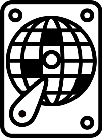

*Like autoruns for discs.*

# discoruns 
<a href="https://github.com/korbster/discoruns-dev/actions"></a>
<a href="https://pypi.org/project/discoruns/"></a>

Repository for a persistence mechanisms extraction tool that is developed alongside my bachelor thesis researches.

### Installation

Discoruns requires [docker](https://docs.docker.com/get-docker/) to be installed.

The Python installation can be easily done via pip:

```bash
pip install discoruns
```

### Usage

```bash
discoruns image myimage.vmdk
```
